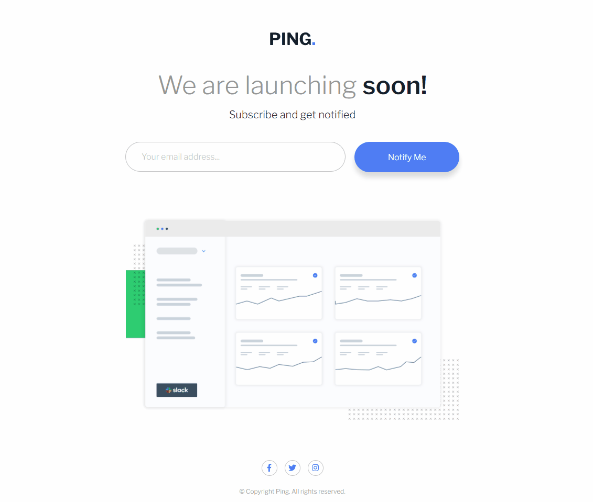
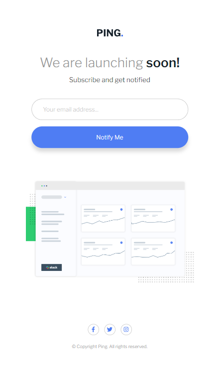

# Desafio do frontend mentor - Ping comming soon page solution 

Esta é uma solução para o [Desafio Ping coming soon page do Frontend Mentor](https://www.frontendmentor.io/challenges/ping-single-column-coming-soon-page-5cadd051fec04111f7b848da).

## Índice

- [Visão geral](#visão-geral)
  - [Desafio](#desafio)
  - [Screenshot](#screenshot)
  - [Links](#links)
- [Meu processo](#meu-processo)
  - [Tecnologias utilizadas](#tecnologias-utilizadas)
  - [Desenvolvimento](#desenvolvimento)
- [Autor](#autor)

## Visão geral

### Desafio

- criar o layout ideal para o projeto, dependendo do tamanho da tela do dispositivo.
- adicionar o efeito de hover para todos os elementos interativos na página.
- enviar o endereço de e-mail usando um campo `input`
- Receba uma mensagem de erro quando o `formulário` for enviado se:
    - O campo `input` está vazio.A mensagem desse erro deve ser `"Whoops! It looks like you forgot to add your email"`
    - O endereço de e-mail não está no formato correto (ou seja, um endereço de e-mail correto deve ter esta estrutura: `name@host.tld`). A mensagem para este erro deve dizer `"Please provide a valid email address"`

### Screenshot

#### Desktop

#### Mobile

### Links

- URL da página: [Ping coming soon page](https://alexjr53.github.io/Ping-comming-soon-page/) 
- solução do projeto no frontend mentor: [Ping coming soon page]()

## Meu processo

### Tecnologias utilizadas

- HTML
- CSS
- Javascript

### Desenvolvimento

Atualmente estou usando desafios do frontend mentor apenas para praticar, aprimorando assim meus conhecimentos de HTML e CSS, para que no futuro possa aprimorar este e outros projetos também feitos a partir do frontend mentor.

## Autor
Alexsandro rosa junior

- GitHub - [Alexjr53](https://github.com/Alexjr53)